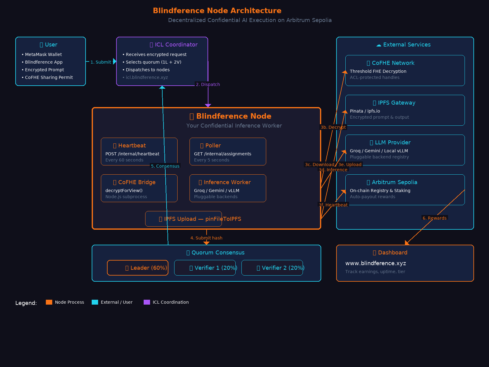

# ⚠️ TESTNET ONLY — DO NOT USE REAL FUNDS

> **This software runs on Arbitrum Sepolia testnet.**
> Use a dedicated test wallet with no mainnet assets. Never use private keys that hold real funds.
> The staking, rewards, and slashing mechanics are real on testnet but have no mainnet value.
> [Read Security Best Practices →](#security-model)

---

# Blindference Node

[](https://pypi.org/project/blindference-node/)
[](https://www.python.org/downloads/)
[](https://nodejs.org/)
[](https://opensource.org/licenses/MIT)

**Confidential inference worker for the Blindference decentralized AI execution network.**

Run encrypted inference jobs, earn BLIND tokens, and help build a private, verifiable, and economically accountable AI execution layer on Arbitrum Sepolia.

🔗 **Live Services:**
- Dashboard: [www.blindference.xyz](https://www.blindference.xyz)
- ICL API: [icl.blindference.xyz](https://icl.blindference.xyz)
- Payment Service: [payment.blindference.xyz](https://payment.blindference.xyz)

---

## What It Does

Blindference Node is the runtime that executes confidential inference tasks assigned by the Inference Coordination Layer (ICL). Each node:

- **Attests** its identity and capabilities to the ICL (mock TEE for tier 0, TPM/TEE for higher tiers)
- **Heartbeats** every 60 seconds to prove liveness (ICL) and every 10 days on-chain
- **Polls** for pending job assignments every 5 seconds
- **Decrypts** encrypted prompts via CoFHE threshold FHE under strict ACL
- **Executes** inference via Groq Llama 3, Google Gemini, or local vLLM (pluggable backends)
- **Commits** results back to the ICL for quorum consensus
- **Earns** BLIND fees for successful task completion — viewable at [www.blindference.xyz](https://www.blindference.xyz)

---

## Architecture



**View interactive versions:**
- [Mermaid (GitHub native)](docs/assets/architecture.mermaid.md)
- [Excalidraw (importable)](docs/assets/architecture.excalidraw) — open at [excalidraw.com](https://excalidraw.com)
- [ASCII fallback](docs/assets/architecture-ascii.md)

**Data Flow:**
1. **User** submits encrypted prompt via MetaMask + Blindference App
2. **ICL** (icl.blindference.xyz) selects quorum: 1 Leader + 2 Verifiers
3. **Node** receives assignment, runs 5 concurrent processes:
   - **Heartbeat** (60s): `POST /internal/heartbeat` — proves liveness
   - **Poller** (5s): `GET /internal/assignments/{addr}` — fetches jobs
   - **CoFHE Bridge**: `decryptForView()` — threshold FHE decryption
   - **Inference Worker**: Groq / Gemini / vLLM — runs the model
   - **IPFS Uploader**: `pinFileToIPFS` — uploads encrypted result
4. **Quorum**: All 3 nodes submit result hashes. Leader output used if 2+ verifiers confirm.
5. **On-Chain**: Commitments recorded on Arbitrum Sepolia, rewards auto-distributed (60% leader, 20% each verifier)
6. **Dashboard**: View real-time earnings at [www.blindference.xyz](https://www.blindference.xyz)

---

## 🚀 5-Minute Quick Start

### Prerequisites

Blindference Node requires **both** Python and Node.js runtimes:

| Runtime | Minimum Version | Check Command | Why Required |
|---------|----------------|---------------|--------------|
| **Python** | 3.10+ | `python --version` | CLI, wallet management, inference backends |
| **Node.js** | 18+ | `node --version` | CoFHE bridge (`cofhe_bridge.mjs`) |
| **npm** | bundled with Node | `npm --version` | Installing CoFHE SDK and viem dependencies |
| **Git** | any | `git --version` | Clone repository |

```bash
# Verify your environment
python --version   # Should print 3.10.x or higher
node --version     # Should print v18.x.x or higher
npm --version      # Should print 10.x.x or higher
git --version      # Any version works
```

If either is missing:
- **Python**: [python.org/downloads](https://www.python.org/downloads/) or `apt install python3 python3-pip`
- **Node.js**: [nodejs.org](https://nodejs.org/) or `apt install nodejs npm`
- **Git**: `apt install git` or [git-scm.com](https://git-scm.com/)

### Step 1: Clone & Install

```bash
git clone https://github.com/AbhishekPanwarr/Blindference-node.git
cd Blindference-node

# Install Node.js dependencies (CoFHE bridge)
npm install

# Install Python dependencies
pip install -r requirements.txt

# Install the CLI package in development mode
pip install -e .
```

**What this installs:**
- `@cofhe/sdk` — Fhenix CoFHE client for confidential decryption
- `viem` — Ethereum client for on-chain interactions
- Python packages: `click`, `web3`, `eth-account`, `cryptography`, `pydantic`, `rich`, `PyYAML`, `aiohttp`

### Step 2: Verify Installation

```bash
blindference-node --help
```

You should see CLI commands: `init`, `attest`, `run`, `status`, `staking`, `models`, etc.

### Step 3: Configure (Non-Interactive Fast Path)

Create `config.json` manually to skip the interactive `init` wizard:

```bash
# Set your environment variables first
export BLF_PRIVATE_KEY=0x...                    # Your testnet private key (NOT mainnet!)
export BLF_KEY_PASSWORD=secure_password         # Keystore encryption password
export BLF_RPC_URL=https://arb-sepolia.g.alchemy.com/v2/YOUR_KEY
export BLF_COFHE_ENDPOINT=$BLF_RPC_URL
export GROQ_API_KEY=gsk_...                       # Optional: enables Groq backend
export GOOGLE_API_KEY=AIza...                     # Optional: enables Gemini backend
```

> ⚠️ **Get a free Alchemy key at [dashboard.alchemy.com](https://dashboard.alchemy.com/apps)**
> The default URL `https://arb-sepolia.g.alchemy.com/v2/demo` is a placeholder and will fail.

Generate the keystore and config:

```bash
# This creates keystore.json (encrypted wallet) and config.json
python3 << 'EOF'
import json, os, getpass
from eth_account import Account

# Generate or load wallet
private_key = os.environ['BLF_PRIVATE_KEY']
account = Account.from_key(private_key)

# Create keystore
password = os.environ['BLF_KEY_PASSWORD']
keystore = Account.encrypt(private_key, password)

with open('keystore.json', 'w') as f:
    json.dump(keystore, f)

# Create config
config = {
    "node_address": account.address,
    "keystore_path": "./keystore.json",
    "tier": 0,
    "supported_model_ids": ["groq:llama-3.3-70b-versatile", "gemini:gemini-2.5-flash"],
    "custom_backends": [],
    "attestation_backend": "mock",
    "icl_endpoint": "https://icl.blindference.xyz",
    "rpc_url": os.environ['BLF_RPC_URL'],
    "ipfs_gateway": "https://ipfs.io/ipfs",
    "model_cache_dir": "./models",
    "log_level": "INFO",
    "network": "arbitrum_sepolia",
    "attestation_cert_hash": "",
    "attestation_expiry": 0,
    "registered_on_chain": False,
    "stake_amount_wei": 0,
    "cofhe_mode": "bridge",
    "cofhe_endpoint": os.environ['BLF_COFHE_ENDPOINT'],
    "cofhe_chain_id": 421614,
    "skip_output_key_storage": False
}

with open('config.json', 'w') as f:
    json.dump(config, f, indent=2)

print(f"Created config.json for node: {account.address}")
EOF
```

### Step 4: Attest & Stake

```bash
# Mock attestation (tier 0, software-only — for development)
blindference-node attest --mock

# Stake minimum 1000 BLIND to join quorums
blindference-node staking stake 1000

# Verify your stake
blindference-node staking status
```

**Staking Economics:**
- Minimum stake: **1000 BLIND**
- Unbonding period: **96 hours**
- Reward per job: **1 BLIND** (60% leader, 20% each verifier)
- Slashing: **3 consecutive failures** → entire stake hard-slashed on-chain

### Step 5: Start Earning

```bash
blindference-node run
```

The daemon starts four concurrent loops:

| Loop | Frequency | Purpose |
|------|-----------|---------|
| **ICL Heartbeat** | Every 60s | Proves liveness to ICL (free REST call) |
| **On-Chain Heartbeat** | Every 10 days | Proves liveness to NodeRegistry (gas tx) |
| **Attestation Watchdog** | Every 10min | Auto-re-attests if certificate expires within 6h |
| **Assignment Poller** | Every 5s | Polls ICL for pending inference jobs |

Visit [www.blindference.xyz](https://www.blindference.xyz) → **Nodes** tab to see your earnings and job history in real-time.

---

## 📊 Dashboard & Earnings

Track your node performance at **[www.blindference.xyz](https://www.blindference.xyz)**:

### Node Dashboard


- **Total Jobs**: All-time inference tasks processed
- **Success Rate**: Percentage of completed vs failed jobs
- **BLIND Earned**: Cumulative rewards from leader and verifier roles
- **Current Stake**: Active BLIND tokens staked for quorum participation
- **Pending Rewards**: Rewards awaiting on-chain distribution

### Job History


- **Role**: Leader (60% reward) or Verifier (20% reward)
- **Model**: Which LLM was used (Groq, Gemini, etc.)
- **Status**: Completed, Refunded, or Rejected
- **Reward**: BLIND tokens earned per job
- **Date**: When the job was processed

**Access the dashboard:**
1. Visit [www.blindference.xyz](https://www.blindference.xyz)
2. Connect your MetaMask wallet (same address as your node)
3. Click **Nodes** tab
4. View stats, earnings, and detailed job history

---

## 🔧 Full Setup Guide

### Interactive Initialization

If you prefer the interactive wizard (with GPU detection):

```bash
blindference-node init
```

This will:
1. Detect GPU capabilities (or default to cloud inference)
2. Auto-detect cloud API keys (Groq / Gemini) from environment
3. Generate an encrypted Ethereum wallet keystore
4. Save configuration to `./config.json`

> **Note:** GPU detection may crash in some environments (e.g., headless servers, containers without nvidia-smi). If this happens, use the [non-interactive fast path](#step-3-configure-non-interactive-fast-path) above.

### Attestation Tiers

| Tier | Name | Requirements | Use Case |
|------|------|--------------|----------|
| **0** | Mock | Software-only (HMAC-SHA256) | Development, testing |
| **1** | TPM 2.0 | TPM-backed with measured boot | Staging, trusted hardware |
| **2** | TEE (SGX/SEV) | Intel SGX or AMD SEV enclave | Production, maximum trust |

```bash
# Mock attestation (development)
blindference-node attest --mock

# Interactive attestation (choose tier)
blindference-node attest
```

After ICL attestation, optionally register on-chain:

```bash
blindference-node attest --mock --register-on-chain
```

### Staking Deep Dive

```bash
# Check your current stake
blindference-node staking status

# Stake 1000 BLIND (minimum for quorum participation)
blindference-node staking stake 1000

# Initiate unstake (starts 96h unbonding period)
blindference-node staking unstake

# Complete withdrawal after unbonding period
blindference-node staking withdraw
```

**Reward Distribution:**
```
Job Reward: 1 BLIND
├── Leader: 0.6 BLIND (60%)
├── Verifier 1: 0.2 BLIND (20%)
└── Verifier 2: 0.2 BLIND (20%)
```

**Slashing Conditions:**
- Failed attestation (missing or expired certificate)
- Missed heartbeat (no ICL heartbeat within 5 minutes)
- Bad inference (verifier consensus shows wrong result)
- Timeout (failed to submit result within execution window)
- 3 consecutive failures → entire stake hard-slashed on-chain

### Daemon Lifecycle

The `blindference-node run` command starts a daemon with four concurrent loops:

```
┌─────────────────────────────────────────────┐
│           BLINDFERENCE NODE DAEMON           │
├─────────────────────────────────────────────┤
│                                             │
│  💓 Heartbeat Loop        (every 60s)      │
│     POST /internal/heartbeat                 │
│     Proves liveness to ICL                 │
│                                             │
│  📡 Assignment Poller     (every 5s)       │
│     GET /internal/assignments/{addr}       │
│     Fetches pending inference jobs         │
│                                             │
│  🔐 Attestation Watchdog  (every 10min)    │
│     Auto-re-attests if cert expires < 6h   │
│                                             │
│  ⛓ On-Chain Heartbeat   (every 10 days)    │
│     NodeRegistry.heartbeat()             │
│     Gas transaction to prove liveness      │
│                                             │
└─────────────────────────────────────────────┘
```

When an assignment is received:
1. **Download** encrypted prompt from IPFS
2. **Decrypt** via CoFHE bridge (`decryptForView()` with sharing permit)
3. **Run inference** through selected backend (Groq/Gemini/vLLM)
4. **Upload** encrypted result to IPFS
5. **Submit** result hash to ICL for quorum consensus
6. **Earn** BLIND rewards if consensus is reached

---

## 💻 CLI Commands Reference

### Core Commands

```bash
# Initialize node — generate wallet, detect GPU, save config
blindference-node init

# Attest node with ICL (mock / TPM / TEE)
blindference-node attest --mock

# Start daemon — heartbeat, watchdog, job polling & execution
blindference-node run

# Show node status — address, tier, models, cert expiry
blindference-node status
```

### Staking Commands

```bash
# Stake BLIND tokens to join inference quorums
blindference-node staking stake 1000

# Check your stake status and failure count
blindference-node staking status

# Initiate unstake (starts 96h unbonding)
blindference-node staking unstake

# Complete withdrawal after unbonding period
blindference-node staking withdraw
```

### Job Commands

```bash
# List completed jobs and BLIND earnings
blindference-node jobs list

# Total BLIND earned across all completed jobs
blindference-node jobs earnings
```

### Model Commands

```bash
# List all registered inference backends and availability
blindference-node models list

# Test a specific backend with a prompt
blindference-node models test groq:llama-3.3-70b-versatile "What is 2+2?"

# Register a custom backend from a dotted Python path
blindference-node models add my_package.backends:MyBackend
```

### Monitoring Commands

```bash
# Current BLIND token balance
blindference-node balance

# Run GPU determinism self-test with vLLM or cloud APIs
blindference-node test-determinism
```

---

## 🔌 Environment Variables

All configuration can be overridden via environment variables prefixed with `BLF_`:

| Variable | Type | Description | Default |
|----------|------|-------------|---------|
| `BLF_PRIVATE_KEY` | string | Operator wallet private key (hex) | *(none)* |
| `BLF_KEY_PASSWORD` | string | Keystore decryption password | *(none)* |
| `BLF_ICL_ENDPOINT` | string | ICL base URL | `https://icl.blindference.xyz` |
| `BLF_RPC_URL` | string | Arbitrum Sepolia RPC endpoint | *(none — must set)* |
| `BLF_COFHE_ENDPOINT` | string | CoFHE/EVM RPC endpoint | Same as `BLF_RPC_URL` |
| `BLF_COFHE_CHAIN_ID` | int | Chain ID for CoFHE | `421614` |
| `BLF_COFHE_MODE` | string | `bridge` (TypeScript) or `python` (HTTP) | `bridge` |
| `BLF_CONFIG_DIR` | string | Config directory path | `./` (current dir) |
| `BLF_LOG_LEVEL` | string | Logging verbosity | `INFO` |
| `BLF_STAKE_AMOUNT` | int | Default stake amount | `1000` |
| `GROQ_API_KEY` | string | Enables Groq cloud backend | *(none)* |
| `GOOGLE_API_KEY` | string | Enables Gemini cloud backend | *(none)* |
| `PINATA_JWT` | string | Pinata API key for IPFS uploads | *(none)* |
| `PINATA_GATEWAY_URL` | string | IPFS download gateway | `https://ipfs.io/ipfs` |

**Critical: Set Real RPC Endpoints**

The default Alchemy URL `https://arb-sepolia.g.alchemy.com/v2/demo` is a **placeholder** and will fail:

```bash
# Get a free key at https://dashboard.alchemy.com/apps
export BLF_RPC_URL='https://arb-sepolia.g.alchemy.com/v2/YOUR_REAL_KEY'
export BLF_COFHE_ENDPOINT='https://arb-sepolia.g.alchemy.com/v2/YOUR_REAL_KEY'
```

Without a real RPC endpoint, the node will crash during CoFHE decryption with:
```
Invalid CoFHE RPC URL: https://arb-sepolia.g.alchemy.com/v2/demo
The default Alchemy key is a placeholder. Set a real key.
```

---

## 🤖 Model Backends

Blindference Node uses a **pluggable backend registry** to support multiple inference providers.

### Built-in Backends

| Backend | Description | Requirements | Model IDs |
|---------|-------------|--------------|-----------|
| `groq` | Groq cloud API (fastest) | `GROQ_API_KEY` env var | `groq:llama-3.3-70b-versatile` |
| `gemini` | Google Gemini REST API | `GOOGLE_API_KEY` env var | `gemini:gemini-2.5-flash` |
| `vllm` | Local GPU inference | NVIDIA GPU + `vllm` package | `facebook/opt-125m` |
| `mock` | Deterministic SHA-256 fallback | Always available | `*` (universal fallback) |

### Custom Backends

```python
from blindference_node.models.base import ModelBackend

class MyBackend(ModelBackend):
    def name(self) -> str: return "my-backend"
    def is_available(self) -> bool: return True
    def supported_models(self) -> list[str]: return ["my-model"]
    def run(self, model_id: str, prompt: str) -> str: return "result"
```

Register via CLI:

```bash
blindference-node models add my_package.backends:MyBackend
```

---

## 🛠️ Troubleshooting

### "Invalid CoFHE RPC URL" error

**Symptom:**
```
Invalid CoFHE RPC URL: https://arb-sepolia.g.alchemy.com/v2/demo
The default Alchemy key is a placeholder. Set a real key.
```

**Fix:**
```bash
export BLF_RPC_URL='https://arb-sepolia.g.alchemy.com/v2/YOUR_REAL_KEY'
export BLF_COFHE_ENDPOINT='https://arb-sepolia.g.alchemy.com/v2/YOUR_REAL_KEY'
```

Get a free key at [alchemy.com](https://dashboard.alchemy.com/apps).

### "CoFHE bridge process exited with code 1"

**Symptom:** Node crashes during job execution with bridge exit code 1.

**Fix:** Ensure you ran `npm install` in the repo root before starting the node. The bridge requires `@cofhe/sdk` and `viem` Node.js packages.

```bash
cd /path/to/Blindference-node
npm install
```

### "Module not found: @cofhe/sdk"

**Symptom:**
```
Error [ERR_MODULE_NOT_FOUND]: Cannot find package '@cofhe/sdk'
```

**Fix:** You skipped `npm install`. Run it now:
```bash
npm install
```

### "Permission denied: blindference-node"

**Symptom:** Command not found after `pip install -e .`.

**Fix:** Ensure your Python environment's `bin/` directory is in `PATH`, or use the full path:
```bash
python -m blindference_node.cli --help
```

### "GPU detection crash during init"

**Symptom:** `blindference-node init` crashes with nvidia-smi error.

**Fix:** Use the [non-interactive fast path](#step-3-configure-non-interactive-fast-path) to manually create `config.json` and `keystore.json` without running `init`.

### "IPFS download failed: 400 Bad Request"

**Symptom:** Frontend or agent cannot download encrypted output from IPFS.

**Causes & Fixes:**
1. **JWT mismatch**: Node uploads to one Pinata account, but download tries another. Ensure `PINATA_JWT` in your node environment matches the gateway you're downloading from.
2. **Propagation delay**: Public gateways (`ipfs.io`) may not immediately find Pinata-pinned content. Use your dedicated Pinata gateway: `https://YOUR_GATEWAY.mypinata.cloud/ipfs`
3. **Account changed**: If you changed Pinata accounts, update `PINATA_JWT` everywhere (node env, frontend env, Railway dashboard).

### "Alchemy rate limit exceeded"

**Symptom:** Node logs show 429 errors from RPC endpoint.

**Fix:** Alchemy free tier has rate limits. Upgrade to paid tier or add retry logic:
```bash
# Use a dedicated API key per node
export BLF_RPC_URL='https://arb-sepolia.g.alchemy.com/v2/DEDICATED_KEY_FOR_NODE_1'
```

---

## 🏗️ Architecture

### System Overview

```
User (MetaMask)
    ↓ Encrypted prompt + CoFHE sharing permit
ICL Coordinator (icl.blindference.xyz)
    ↓ Select quorum (1 Leader + 2 Verifiers)
Blindference Node (Your Machine)
    ├─ Heartbeat → ICL (60s)
    ├─ Poller → ICL (5s)
    ├─ CoFHE Bridge → Threshold Decryption
    ├─ Inference Worker → Groq / Gemini / vLLM
    └─ IPFS Uploader → Encrypted result
Quorum Consensus
    ├─ Leader submits result hash (60% reward)
    ├─ Verifier 1 confirms/rejects (20% reward)
    └─ Verifier 2 confirms/rejects (20% reward)
Arbitrum Sepolia (On-Chain)
    ├─ Record commitment
    ├─ Auto-distribute rewards
    └─ Staking / slashing
Dashboard (www.blindference.xyz)
    └─ View earnings & job history
```

### Security Model

#### Tier 0 (Mock Attestation)

- Software-only attestation with no hardware trust
- Quote: HMAC-SHA256 of nonce + runtime code hash
- **For development only** — nodes can be impersonated

#### Tier 1 (TPM 2.0)

- TPM-backed attestation with measured boot
- Hardware-bound identity
- Requires TPM 2.0 chip

#### Tier 2 (TEE / SGX / TDX)

- Intel SGX or AMD SEV enclave attestation
- Confidential computing — code and data encrypted in memory
- Remote attestation verified by ICL against manufacturer quoting enclaves

#### Slashing Conditions

Nodes may be slashed for:
- **Failed attestation**: Missing or expired certificate
- **Missed heartbeat**: No ICL heartbeat within 5 minutes
- **Bad inference**: Verifier consensus shows wrong result
- **Timeout**: Failed to submit result within execution window
- **3 consecutive failures** → entire stake hard-slashed on-chain

---

## ⚙️ Configuration

All configuration is stored in `./config.json` (or `~/.blindference/config.json` if `BLF_CONFIG_DIR` is set) and can be overridden via environment variables prefixed with `BLF_`.

### Default Config

```json
{
  "node_address": "0x...",
  "keystore_path": "./keystore.json",
  "tier": 0,
  "supported_model_ids": ["groq:llama-3.3-70b-versatile", "gemini:gemini-2.5-flash"],
  "custom_backends": [],
  "attestation_backend": "mock",
  "icl_endpoint": "https://icl.blindference.xyz",
  "rpc_url": "",
  "ipfs_gateway": "https://ipfs.io/ipfs",
  "model_cache_dir": "./models",
  "log_level": "INFO",
  "network": "arbitrum_sepolia",
  "attestation_cert_hash": "",
  "attestation_expiry": 0,
  "registered_on_chain": false,
  "stake_amount_wei": 0,
  "cofhe_mode": "bridge",
  "cofhe_endpoint": "",
  "cofhe_chain_id": 421614,
  "skip_output_key_storage": false
}
```

### CoFHE Modes

**`bridge` (default)**: Spawns a TypeScript subprocess via `@cofhe/sdk/node` for CoFHE operations. More reliable, handles SDK lifecycle correctly.

**`python` (alternative)**: Direct HTTP calls to CoFHE endpoints. Lighter weight but requires manual session management.

---

## 🐳 Development

### Docker

```bash
# Build image
docker build -t blindference-node .

# Run container
docker run -d \
  --name blindference-node \
  -e BLF_KEY_PASSWORD=secure_password \
  -e BLF_ICL_ENDPOINT=https://icl.blindference.xyz \
  -e BLF_RPC_URL=https://arb-sepolia.g.alchemy.com/v2/YOUR_KEY \
  -v /host/config:/root/.blindference \
  blindference-node run
```

### Testing

```bash
# Run all tests
pytest tests/ -v

# Run specific test
pytest tests/test_node_loop.py -v
```

### Contributing

We welcome contributions! Please see [CONTRIBUTING.md](./CONTRIBUTING.md) for guidelines.

### Project Structure

```text
Blindference-node/
├── blindference_node/          # Main package
│   ├── __init__.py
│   ├── cli.py                  # CLI entry points (init, attest, run, status, models)
│   ├── node_loop.py            # Daemon with heartbeat, watchdog, poller
│   ├── job_handler.py          # Task execution logic
│   ├── crypto.py               # CoFHE client, AES blob encryption/decryption
│   ├── icl_client.py           # ICL REST API client
│   ├── wallet.py               # Ethereum wallet generation and loading
│   ├── registry.py             # On-chain registration and heartbeat
│   ├── config.py               # Configuration management
│   ├── attestation/            # Attestation backends (mock, TPM, TEE)
│   ├── models/                 # Pluggable inference backends
│   │   ├── base.py
│   │   ├── vllm_backend.py
│   │   ├── groq_backend.py
│   │   ├── gemini_backend.py
│   │   ├── mock_backend.py
│   │   └── registry.py
│   ├── backend_loader.py       # Dynamic backend loading
│   └── scripts/                # TypeScript CoFHE bridge
│       └── cofhe_bridge.mjs
├── tests/                      # Test suite
│   ├── test_crypto.py
│   ├── test_job_handler.py
│   ├── test_node_loop.py
│   ├── test_icl_client.py
│   ├── test_registry.py
│   ├── test_e2e.py
│   └── test_wallet.py
├── contracts/                  # Solidity contract ABIs
├── docs/                     # Documentation assets
│   └── assets/
│       ├── architecture.png
│       ├── architecture.mermaid.md
│       ├── architecture.excalidraw
│       ├── architecture-ascii.md
│       ├── node-dashboard.png
│       └── node-jobs-history.png
├── package.json              # Node.js dependencies (CoFHE SDK, viem)
├── pyproject.toml            # Package configuration
├── requirements.txt          # Python dependencies
├── docker-compose.yml        # Docker orchestration
├── Dockerfile                # Container image
└── README.md                 # This file
```

---

## 📦 PyPI Package (Advanced — Manual npm install Required)

⚠️ **WARNING: `pip install` alone will NOT work.**  
The wheel includes Python code but **NOT Node.js dependencies**. After `pip install`, you **must** run `npm install` inside the installed package directory to install the CoFHE bridge (`@cofhe/sdk`, `viem`).

**For first-time setup, [clone the repository](#-5-minute-quick-start) — it's the only fully-supported path.**

### PyPI Install (Experts Only)

```bash
# 1. Install Python package from PyPI
pip install blindference-node

# 2. Install Node.js dependencies (REQUIRED — the wheel does not bundle these)
BLF_NODE_DIR=$(python -c "import blindference_node, os; print(os.path.dirname(blindference_node.__file__))")
cd "$BLF_NODE_DIR" && npm install

# 3. Verify installation
blindference-node --help
```

If you skip step 2, you will get:
```
Error [ERR_MODULE_NOT_FOUND]: Cannot find package '@cofhe/sdk'
```

### Why This Happens

Python wheels (`pip install`) **cannot bundle Node.js packages**. The CoFHE bridge (`cofhe_bridge.mjs`) requires:
- `@cofhe/sdk` — Fhenix CoFHE client
- `viem` — Ethereum client

These are declared in `package.json` which now ships inside the wheel (v0.3.5+), but you still need to run `npm install` to download them.

### When to Use PyPI

- **Docker/CI deployments** where you want a versioned release
- **Existing setups** where `npm` is already available
- **Not recommended** for first-time users — use `git clone` instead

---

## 🔗 Links & Resources

- **Documentation**: [docs.blindference.xyz](https://docs.blindference.xyz)
- **Dashboard**: [www.blindference.xyz](https://www.blindference.xyz)
- **ICL API**: [icl.blindference.xyz](https://icl.blindference.xyz)
- **Payment Service**: [payment.blindference.xyz](https://payment.blindference.xyz)
- **Discord**: [Blindference Community](https://discord.gg/blindference)
- **Twitter**: [@blindference](https://twitter.com/blindference)
- **Issues**: [GitHub Issues](https://github.com/AbhishekPanwarr/Blindference-node/issues)

---

## 📄 License

MIT License — see [LICENSE](./LICENSE) for details.
