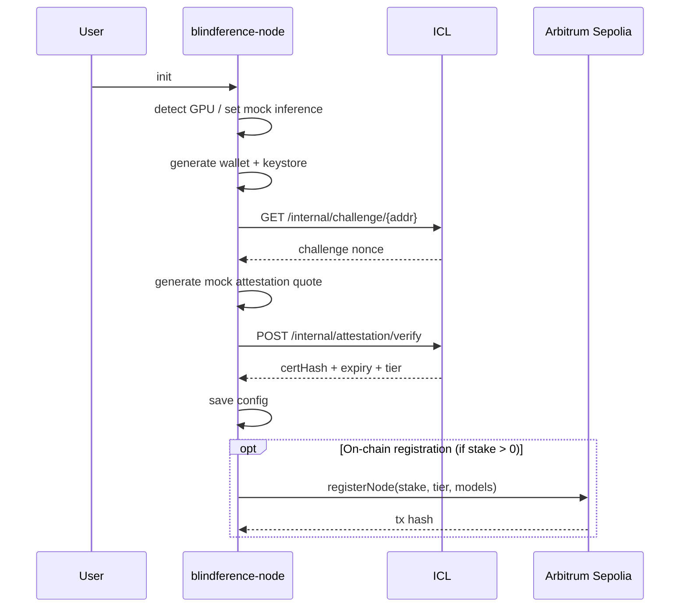
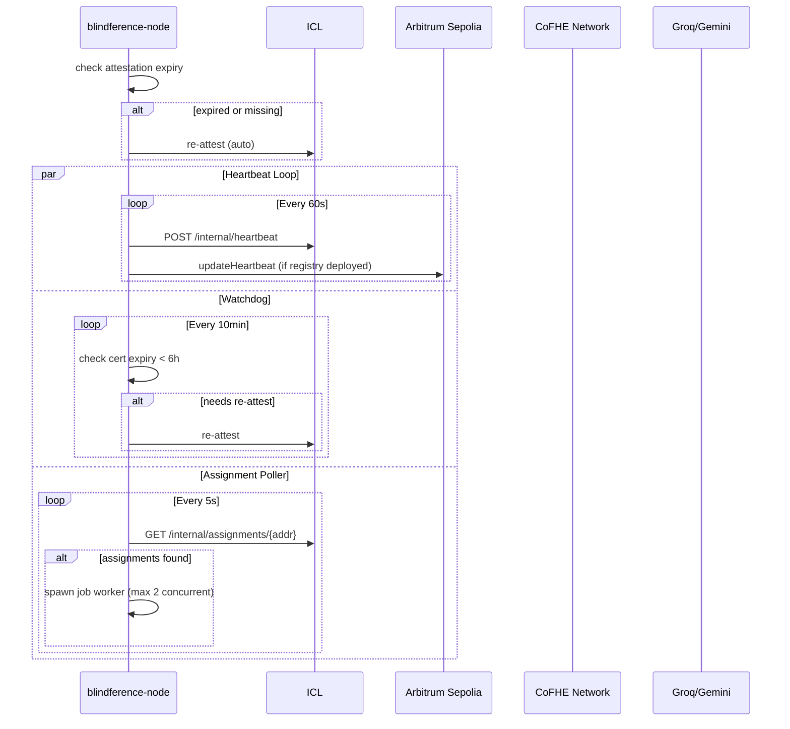
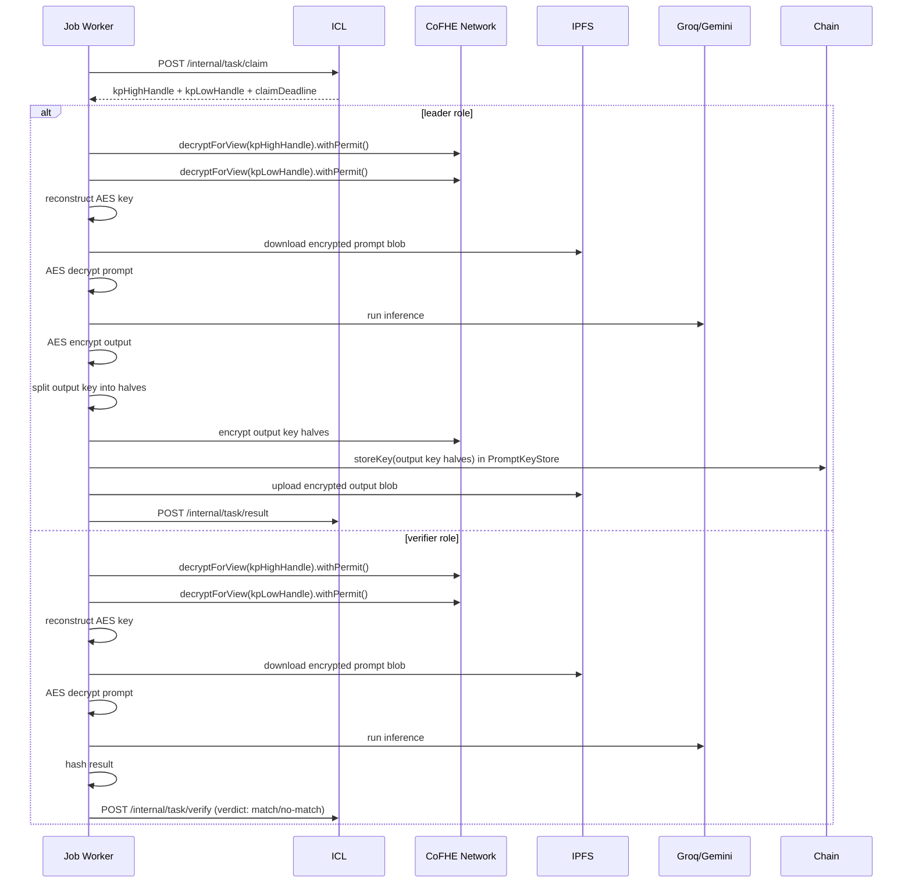

# Blindference Node

**Version 0.3.0** — Confidential inference worker for the Blindference network.

Register your compute machine as a provider in the Blindference decentralized AI execution network. Run encrypted inference jobs, earn fees, and help build a private, verifiable, and economically accountable AI execution layer.

## What It Does

Blindference Node is the runtime that executes confidential inference tasks assigned by the Inference Coordination Layer (ICL). Each node:

- **Attests** its identity and capabilities to the ICL (mock TEE for tier 0, TPM/TEE for higher tiers)
- **Heartbeats** every 60 seconds to prove liveness
- **Polls** for pending job assignments every 5 seconds
- **Decrypts** encrypted prompts via CoFHE threshold FHE under strict ACL
- **Executes** inference via Groq Llama 3 or Google Gemini APIs
- **Commits** results back to the ICL for quorum consensus
- **Earns** fees for successful task completion, may be slashed for bad behavior

## Architecture

```mermaid
flowchart TB
    subgraph "Blindference Node"
        DAEMON[Daemon Process]
        HB[Heartbeat Loop<br/>60s]
        WD[Attestation Watchdog<br/>10min]
        POLL[Assignment Poller<br/>5s]
        WORKER[Job Worker]
        
        DAEMON --> HB
        DAEMON --> WD
        DAEMON --> POLL
        POLL -->|dispatch| WORKER
    end
    
    subgraph "External Services"
        ICL[ICL Coordinator]
        COFHE[CoFHE Network]
        IPFS[IPFS Gateway]
        LLM[Groq / Gemini]
        CHAIN[Arbitrum Sepolia]
    end
    
    HB -->|POST /internal/heartbeat| ICL
    WD -->|GET /internal/challenge| ICL
    WD -->|POST /internal/attestation/verify| ICL
    POLL -->|GET /internal/assignments/{addr}| ICL
    WORKER -->|POST /internal/task/claim| ICL
    WORKER -->|decryptForView| COFHE
    WORKER -->|download blob| IPFS
    WORKER -->|run inference| LLM
    WORKER -->|POST /internal/task/result| ICL
    
    ICL -->|register attestation| CHAIN
```

## Quick Start

### Installation

```bash
# Install from PyPI (when published)
pip install blindference-node

# Or install from source
git clone https://github.com/your-org/Blindference-node.git
cd Blindference-node
pip install -e .

# For GPU-accelerated local inference (optional)
pip install "blindference-node[gpu]"
```

### Initialize Your Node

```bash
# Interactive mode — prompts for password, GPU detection, etc.
blindference-node init

# Non-interactive mode — requires env vars
export BLF_PRIVATE_KEY=0x...
export BLF_KEY_PASSWORD=secure_password
blindference-node init --non-interactive
```

This will:
1. Detect GPU capabilities (or default to mock inference)
2. Generate an encrypted Ethereum wallet keystore
3. Perform mock attestation with the ICL (tier 0)
4. Optionally register on-chain with stake

### Start the Daemon

```bash
# Interactive — prompts for keystore password
blindference-node run

# Non-interactive — uses env var
export BLF_KEY_PASSWORD=secure_password
blindference-node run
```

The daemon starts three concurrent loops:
- **Heartbeat**: Every 60s to ICL and on-chain registry
- **Attestation Watchdog**: Every 10min, auto-re-attests if cert expires within 6h
- **Assignment Poller**: Every 5s, polls ICL for pending jobs

## Commands

| Command | Description | Status |
|---------|-------------|--------|
| `init` | Initialize node — wallet, GPU detection, attestation, on-chain registration | ✅ Ready |
| `run` | Start daemon — heartbeat, watchdog, job polling & execution | ✅ Ready |
| `attest` | Manually trigger re-attestation | ⚠️ Stub (auto-re-attest works) |
| `status` | Show node state — address, tier, stake, recent jobs | ⚠️ Stub |
| `withdraw` | Initiate stake unbonding | ⚠️ Stub |
| `test-determinism` | Run GPU determinism self-test with vLLM | ✅ Ready |

## Configuration

All configuration is stored in `~/.blindference/config.json` and can be overridden via environment variables prefixed with `BLF_`.

### Default Config (`~/.blindference/config.json`)

```json
{
  "node_address": "0x...",
  "keystore_path": "~/.blindference/keystore.json",
  "tier": 0,
  "supported_model_ids": ["qwen2.5-7b"],
  "attestation_backend": "mock",
  "icl_endpoint": "https://icl.blindference.xyz",
  "fhenix_rpc": "https://testnet.fhenix.zone",
  "ipfs_gateway": "https://node.lighthouse.storage",
  "model_cache_dir": "~/.blindference/models",
  "log_level": "INFO",
  "network": "fhenix_testnet",
  "attestation_cert_hash": "",
  "attestation_expiry": 0,
  "stake_amount_wei": 0,
  "cofhe_mode": "bridge",
  "cofhe_endpoint": "https://arb-sepolia.g.alchemy.com/v2/demo",
  "cofhe_chain_id": 421614,
  "skip_output_key_storage": false
}
```

### Environment Variables

| Variable | Type | Description |
|----------|------|-------------|
| `BLF_NODE_ADDRESS` | string | Ethereum address (0x...) |
| `BLF_KEYSTORE_PATH` | string | Path to encrypted keystore |
| `BLF_TIER` | int | Attestation tier (0=mock, 1=TPM, 2=TEE) |
| `BLF_SUPPORTED_MODEL_IDS` | list | Comma-separated model IDs |
| `BLF_ATTESTATION_BACKEND` | string | `mock`, `tpm`, or `sgx` |
| `BLF_ICL_ENDPOINT` | string | ICL base URL |
| `BLF_FHENIX_RPC` | string | EVM RPC endpoint |
| `BLF_IPFS_GATEWAY` | string | IPFS download/upload gateway |
| `BLF_LOG_LEVEL` | string | `DEBUG`, `INFO`, `WARNING`, `ERROR` |
| `BLF_COFHE_MODE` | string | `bridge` (TypeScript subprocess) or `python` (HTTP) |
| `BLF_COFHE_ENDPOINT` | string | CoFHE/EVM RPC endpoint |
| `BLF_COFHE_CHAIN_ID` | int | Chain ID for CoFHE (421614 for Arbitrum Sepolia) |
| `BLF_KEY_PASSWORD` | string | Keystore decryption password (non-interactive mode) |

### CoFHE Modes

**`bridge` (default)**: Spawns a TypeScript subprocess via `@cofhe/sdk/node` for CoFHE operations. More reliable, handles SDK lifecycle correctly.

**`python` (alternative)**: Direct HTTP calls to CoFHE endpoints. Lighter weight but requires manual session management.

## Node Lifecycle

### 1. Initialization (`init`)



### 2. Daemon Execution (`run`)



### 3. Job Execution



## Requirements

- **Python**: 3.10 or higher
- **Operating System**: Linux (tested on Ubuntu 22.04), macOS
- **GPU** (optional): NVIDIA GPU with CUDA support for local vLLM inference
- **Network**: Outbound HTTPS to ICL, Fhenix RPC, IPFS gateway, Groq/Gemini APIs
- **Storage**: ~2GB for model cache (if running local models)

## Development

### Setup

```bash
# Clone repository
git clone https://github.com/your-org/Blindference-node.git
cd Blindference-node

# Create virtual environment
python -m venv venv
source venv/bin/activate

# Install dependencies
pip install -e ".[dev]"

# Run tests
pytest tests/ -v
```

### Project Structure

```text
Blindference-node/
├── blindference_node/          # Main package
│   ├── __init__.py
│   ├── cli.py                  # CLI entry points (init, run, attest)
│   ├── node_loop.py            # Daemon with heartbeat, watchdog, poller
│   ├── job_handler.py          # Task execution logic
│   ├── crypto.py               # CoFHE client, AES blob encryption/decryption
│   ├── icl_client.py           # ICL REST API client
│   ├── wallet.py               # Ethereum wallet generation and loading
│   ├── registry.py             # On-chain registration and heartbeat
│   ├── config.py               # Configuration management
│   ├── attestation.py          # Attestation quote generation
│   └── bridge/                 # TypeScript CoFHE bridge
│       ├── package.json
│       └── src/
│           └── cofhe_bridge.ts # CoFHE SDK bridge subprocess
├── tests/                      # Test suite
│   ├── test_crypto.py
│   ├── test_job_handler.py
│   ├── test_node_loop.py
│   ├── test_icl_client.py
│   └── test_e2e.py
├── contracts/                  # Solidity contracts (interface definitions)
├── scripts/                    # Utility scripts
├── docs/                       # Documentation
│   ├── quickstart.md
│   ├── hardware.md
│   ├── attestation.md
│   └── slashing.md
├── pyproject.toml              # Package configuration
├── docker-compose.yml          # Docker orchestration
├── Dockerfile                  # Container image
└── README.md                   # This file
```

### Running Tests

```bash
# All tests
pytest tests/ -v

# Specific test module
pytest tests/test_crypto.py -v

# End-to-end test (requires ICL mock)
pytest tests/test_e2e.py -v
```

### Docker

```bash
# Build image
docker build -t blindference-node .

# Run container
docker run -e BLF_KEY_PASSWORD=secure_password \
  -e BLF_ICL_ENDPOINT=https://icl.blindference.xyz \
  blindference-node run

# Or use docker-compose for local stack
docker-compose up
```

## Security Model

### Tier 0 (Mock Attestation)

- Software-only attestation with no hardware trust
- Suitable for development and testing
- Quote: SHA-256 hash of nonce + runtime code hash
- **Not for production** — nodes can be easily impersonated

### Tier 1 (TPM)

- TPM-backed attestation with measured boot
- Hardware-bound identity, harder to clone
- Requires TPM 2.0 chip

### Tier 2 (TEE/SGX)

- Intel SGX or AMD SEV enclave attestation
- Confidential computing — code and data encrypted in memory
- Remote attestation verified by ICL against Intel/AMD quoting enclaves

### Slashing Conditions

Nodes may be slashed for:
- **Failed attestation**: Missing or expired attestation certificate
- **Missed heartbeat**: No heartbeat within `HEARTBEAT_GRACE_SECONDS`
- **Bad inference**: Verifier consensus shows leader produced wrong result
- **Timeout**: Failed to submit result within execution window

## Documentation

- [Quickstart Guide](./docs/quickstart.md) — Step-by-step first node setup
- [Hardware Requirements](./docs/hardware.md) — GPU, RAM, network requirements
- [Attestation Guide](./docs/attestation.md) — Mock, TPM, and TEE attestation
- [Slashing & Recovery](./docs/slashing.md) — What gets slashed and how to recover

## Contributing

We welcome contributions! Please see [CONTRIBUTING.md](./CONTRIBUTING.md) for guidelines.

## License

MIT License — see [LICENSE](./LICENSE) for details.

## Support

- Discord: [Blindference Community](https://discord.gg/blindference)
- Twitter: @blindference
- Issues: [GitHub Issues](https://github.com/your-org/Blindference-node/issues)
