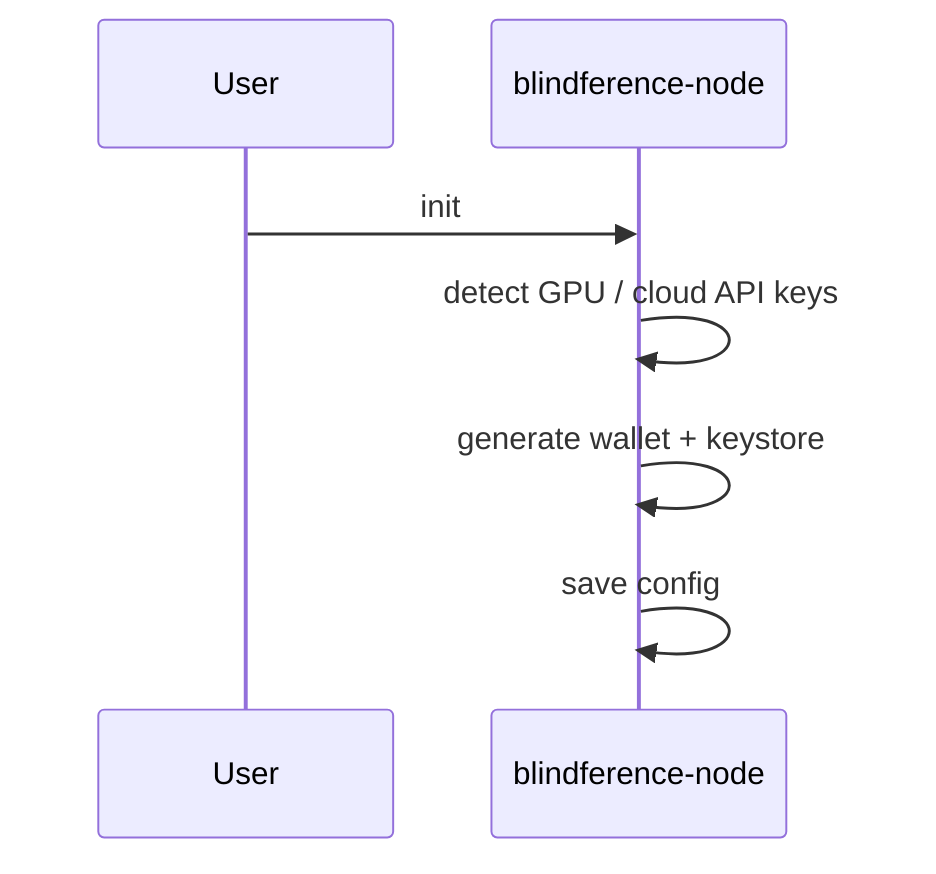
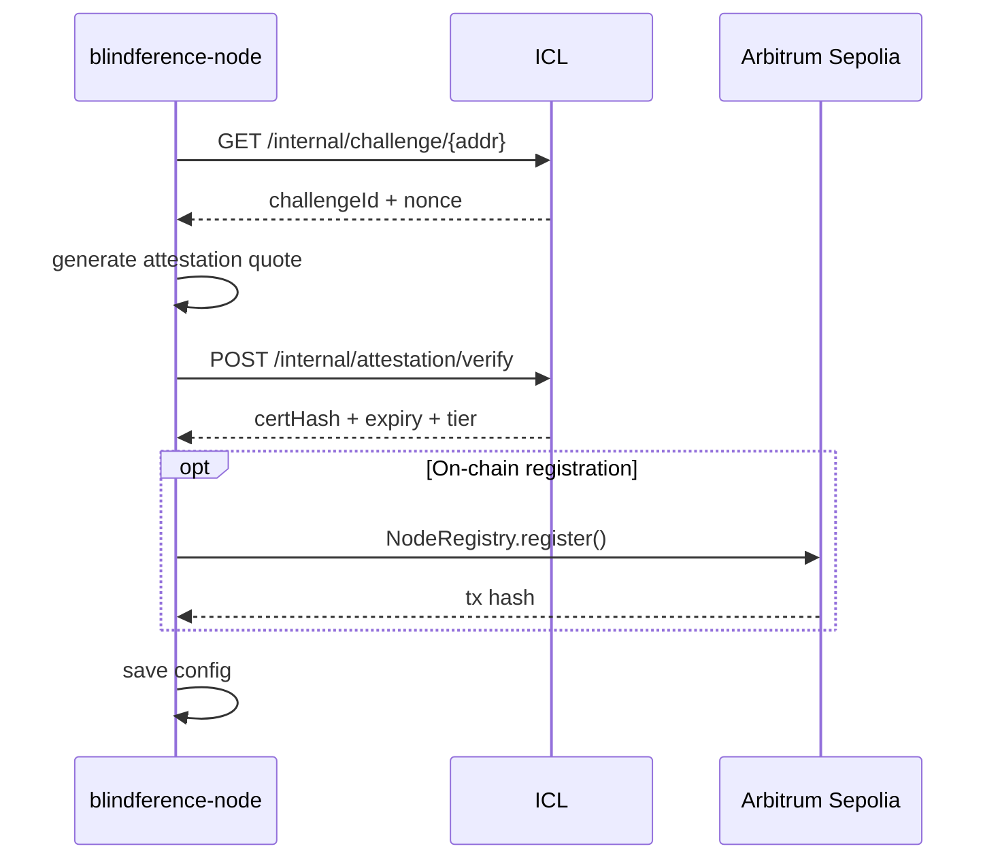
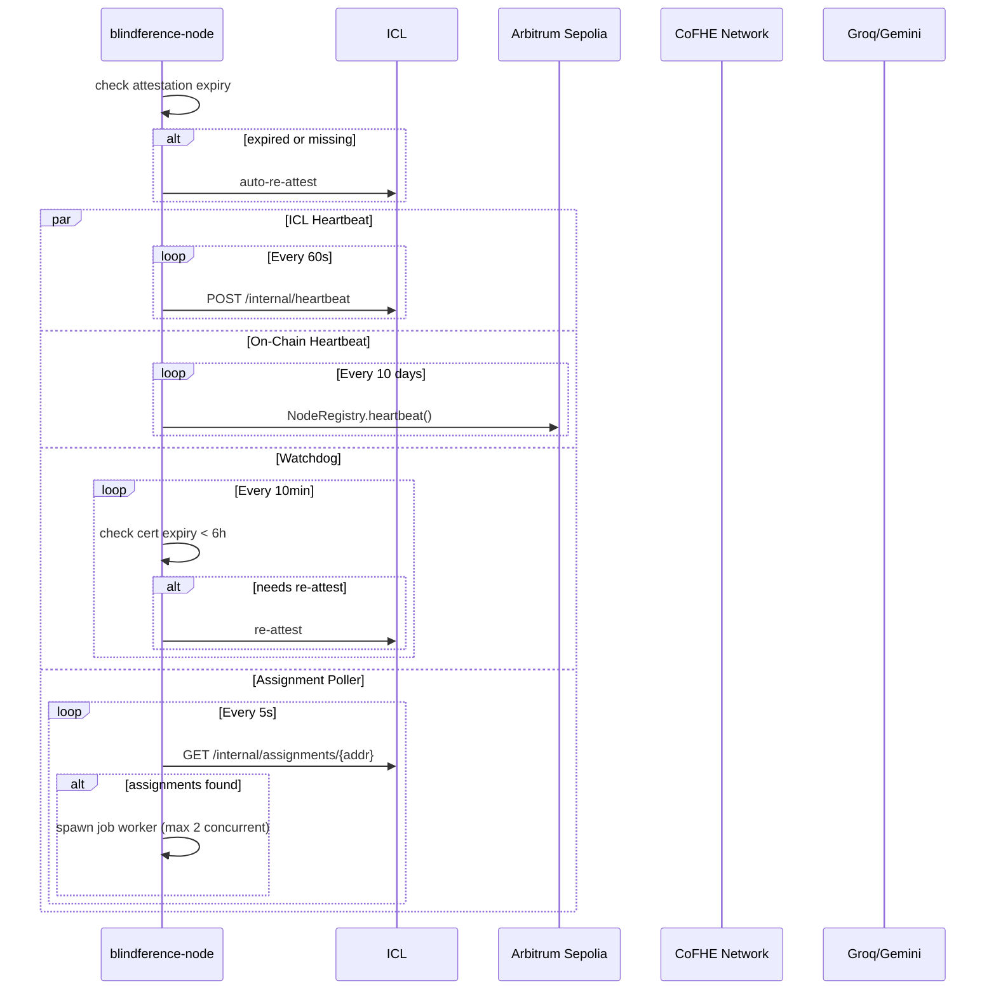
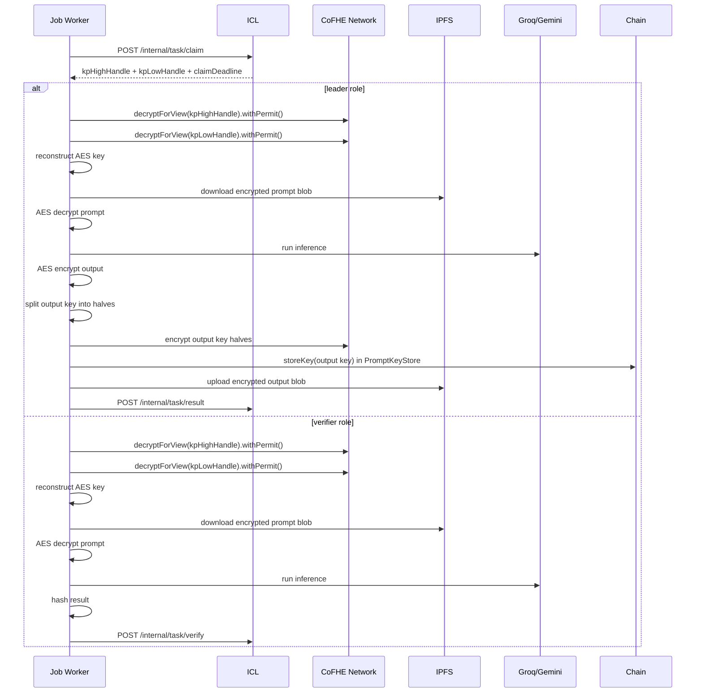

# Blindference Node

[](https://pypi.org/project/blindference-node/)
[](https://www.python.org/downloads/)
[](https://opensource.org/licenses/MIT)

**Confidential inference worker for the Blindference decentralized AI execution network.**

Run encrypted inference jobs, earn fees, and help build a private, verifiable, and economically accountable AI execution layer on Arbitrum Sepolia.

---

## What It Does

Blindference Node is the runtime that executes confidential inference tasks assigned by the Inference Coordination Layer (ICL). Each node:

- **Attests** its identity and capabilities to the ICL (mock TEE for tier 0, TPM/TEE for higher tiers)
- **Heartbeats** every 60 seconds to prove liveness (ICL) and every 10 days on-chain
- **Polls** for pending job assignments every 5 seconds
- **Decrypts** encrypted prompts via CoFHE threshold FHE under strict ACL
- **Executes** inference via Groq Llama 3, Google Gemini, or local vLLM (pluggable backends)
- **Commits** results back to the ICL for quorum consensus
- **Earns** fees for successful task completion

---

## Quick Start

### 1. Install

```bash
pip install blindference-node
```

For GPU-accelerated local inference (optional):

```bash
pip install "blindference-node[gpu]"
```

Or install from source:

```bash
git clone https://github.com/AbhishekPanwarr/Blindference-node.git
cd Blindference-node
pip install -e .
```

### 2. Initialize

```bash
blindference-node init
```

This will:
1. Detect GPU capabilities (or default to mock inference)
2. Auto-detect cloud API keys (Groq / Gemini) from environment
3. Generate an encrypted Ethereum wallet keystore
4. Save configuration to `~/.blindference/config.json`

**Non-interactive mode:**

```bash
export BLF_PRIVATE_KEY=0x...
export BLF_KEY_PASSWORD=secure_password
blindference-node init
```

### 3. Attest

```bash
# Interactive attestation (choose mock or TEE)
blindference-node attest

# Or skip interactive menu and use mock directly
blindference-node attest --mock

# With custom development key
blindference-node attest --mock --tee-key mydevkey
```

After ICL attestation, optionally register on-chain with gas estimation.

### 4. Stake BLIND Tokens

Nodes must stake at least **1000 BLIND** to participate in inference quorums. Staking provides economic security — stake is slashed if a node produces incorrect output or times out.

```bash
# Stake 1000 BLIND (minimum)
blindference-node staking stake 1000

# Check your stake status
blindference-node staking status

# Initiate unstake (starts 96h unbonding)
blindference-node staking unstake

# Complete unstake after unbonding period
blindference-node staking withdraw
```

**Staking Economics:**
- Minimum stake: **1000 BLIND**
- Unbonding period: **96 hours**
- Reward per job: **1 BLIND** (60% leader, 20% each verifier)
- Slashing: **3 consecutive failures** → entire stake hard-slashed on-chain

### 5. Run

```bash
blindference-node run
```

The daemon starts four concurrent loops:

| Loop | Frequency | Purpose |
|------|-----------|---------|
| **ICL Heartbeat** | Every 60s | Proves liveness to ICL (free REST call) |
| **On-Chain Heartbeat** | Every 10 days | Proves liveness to NodeRegistry (gas tx) |
| **Attestation Watchdog** | Every 10min | Auto-re-attests if certificate expires within 6h |
| **Assignment Poller** | Every 5s | Polls ICL for pending inference jobs |

---

## Commands

| Command | Description | Status |
|---------|-------------|--------|
| `init` | Initialize node — wallet, GPU detection, save config | ✅ Ready |
| `attest` | Attest node with ICL (mock / TEE) and optionally register on-chain | ✅ Ready |
| `run` | Start daemon — heartbeat, watchdog, job polling & execution | ✅ Ready |
| `status` | Show node status — address, tier, models, cert expiry | ✅ Ready |
| `staking stake` | Stake BLIND tokens to join inference quorums | ✅ Ready |
| `staking unstake` | Initiate unstake (starts 96h unbonding) | ✅ Ready |
| `staking withdraw` | Complete withdrawal after unbonding period | ✅ Ready |
| `staking status` | Show BLIND stake status and failure count | ✅ Ready |
| `models list` | List all registered inference backends and availability | ✅ Ready |
| `models test` | Test a specific backend with a prompt | ✅ Ready |
| `models add` | Register a custom backend from a dotted Python path | ✅ Ready |
| `test-determinism` | Run GPU determinism self-test with vLLM or cloud APIs | ✅ Ready |

---

## Architecture

```mermaid
flowchart TB
    subgraph "Blindference Node"
        DAEMON[Daemon Process]
        HB[ICL Heartbeat<br/>60s]
        ONCHAIN[On-Chain Heartbeat<br/>10 days]
        WD[Attestation Watchdog<br/>10min]
        POLL[Assignment Poller<br/>5s]
        WORKER[Job Worker]
        
        DAEMON --> HB
        DAEMON --> ONCHAIN
        DAEMON --> WD
        DAEMON --> POLL
        POLL -->|dispatch| WORKER
    end
    
    subgraph "External Services"
        ICL[ICL Coordinator]
        COFHE[CoFHE Network]
        IPFS[IPFS Gateway]
        LLM[Groq / Gemini / vLLM]
        CHAIN[Arbitrum Sepolia]
    end
    
    HB -->|POST /internal/heartbeat| ICL
    ONCHAIN -->|NodeRegistry.heartbeat()| CHAIN
    WD -->|GET /internal/challenge| ICL
    WD -->|POST /internal/attestation/verify| ICL
    POLL -->|GET /internal/assignments/{addr}| ICL
    WORKER -->|POST /internal/task/claim| ICL
    WORKER -->|decryptForView| COFHE
    WORKER -->|download blob| IPFS
    WORKER -->|run inference| LLM
    WORKER -->|POST /internal/task/result| ICL
    
    ICL -->|register attestation| CHAIN
```

---

## Configuration

All configuration is stored in `~/.blindference/config.json` and can be overridden via environment variables prefixed with `BLF_`.

### Default Config

```json
{
  "node_address": "0x...",
  "keystore_path": "~/.blindference/keystore.json",
  "tier": 0,
  "supported_model_ids": ["facebook/opt-125m"],
  "custom_backends": [],
  "attestation_backend": "mock",
  "icl_endpoint": "https://icl.blindference.xyz",
  "fhenix_rpc": "https://testnet.fhenix.zone",
  "ipfs_gateway": "https://node.lighthouse.storage",
  "model_cache_dir": "~/.blindference/models",
  "log_level": "INFO",
  "network": "fhenix_testnet",
  "attestation_cert_hash": "",
  "attestation_expiry": 0,
  "registered_on_chain": false,
  "stake_amount_wei": 0,
  "cofhe_mode": "bridge",
  "cofhe_endpoint": "",
  "cofhe_chain_id": 421614,
  "skip_output_key_storage": false
}
```

### Environment Variables

| Variable | Type | Description |
|----------|------|-------------|
| `BLF_NODE_ADDRESS` | string | Ethereum address (0x...) |
| `BLF_KEYSTORE_PATH` | string | Path to encrypted keystore |
| `BLF_TIER` | int | Attestation tier (0=mock, 1=TPM, 2=TEE) |
| `BLF_SUPPORTED_MODEL_IDS` | list | Comma-separated model IDs |
| `BLF_CUSTOM_BACKENDS` | list | Dotted Python paths for custom backends |
| `BLF_ATTESTATION_BACKEND` | string | `mock`, `tpm`, or `sgx` |
| `BLF_ICL_ENDPOINT` | string | ICL base URL |
| `BLF_FHENIX_RPC` | string | EVM RPC endpoint |
| `BLF_IPFS_GATEWAY` | string | IPFS download/upload gateway |
| `BLF_LOG_LEVEL` | string | `DEBUG`, `INFO`, `WARNING`, `ERROR` |
| `BLF_COFHE_MODE` | string | `bridge` (TypeScript subprocess) or `python` (HTTP) |
| `BLF_COFHE_ENDPOINT` | string | CoFHE/EVM RPC endpoint |
| `BLF_COFHE_CHAIN_ID` | int | Chain ID for CoFHE (421614 for Arbitrum Sepolia) |
| `BLF_KEY_PASSWORD` | string | Keystore decryption password |
| `GROQ_API_KEY` | string | Enables Groq cloud backend |
| `GOOGLE_API_KEY` | string | Enables Gemini cloud backend |
| `MOCK_ATTESTATION_KEY` | string | Override default mock attestation key |

### CoFHE Modes

**`bridge` (default)**: Spawns a TypeScript subprocess via `@cofhe/sdk/node` for CoFHE operations. More reliable, handles SDK lifecycle correctly.

**`python` (alternative)**: Direct HTTP calls to CoFHE endpoints. Lighter weight but requires manual session management.

---

## Model Backends

Blindference Node uses a **pluggable backend registry** to support multiple inference providers.

### Built-in Backends

| Backend | Description | Requirements | Model IDs |
|---------|-------------|--------------|-----------|
| `vllm` | Local GPU inference | NVIDIA GPU + `vllm` package | `facebook/opt-125m` |
| `groq` | Groq cloud API | `GROQ_API_KEY` env var | `groq:llama-3.3-70b-versatile` |
| `gemini` | Google Gemini REST API | `GOOGLE_API_KEY` env var | `gemini:gemini-2.5-flash` |
| `mock` | Deterministic SHA-256 fallback | Always available | `*` (universal fallback) |

### Custom Backends

```python
from blindference_node.models.base import ModelBackend

class MyBackend(ModelBackend):
    def name(self) -> str: return "my-backend"
    def is_available(self) -> bool: return True
    def supported_models(self) -> list[str]: return ["my-model"]
    def run(self, model_id: str, prompt: str) -> str: return "result"
```

Register via CLI:

```bash
blindference-node models add my_package.backends:MyBackend
```

---

## Node Lifecycle

### 1. Initialization (`init`)



### 2. Attestation (`attest`)



### 3. Daemon Execution (`run`)



### 4. Job Execution



---

## Requirements

- **Python**: 3.10 or higher
- **Operating System**: Linux (tested on Ubuntu 22.04), macOS
- **GPU** (optional): NVIDIA GPU with CUDA support for local vLLM inference
- **Network**: Outbound HTTPS to ICL, Fhenix RPC, IPFS gateway, Groq/Gemini APIs
- **Storage**: ~2GB for model cache (if running local models)

---

## Development

### Setup

```bash
# Clone repository
git clone https://github.com/AbhishekPanwarr/Blindference-node.git
cd Blindference-node

# Create virtual environment
python -m venv venv
source venv/bin/activate

# Install dependencies
pip install -e ".[dev]"

# Run tests
pytest tests/ -v
```

### Project Structure

```text
Blindference-node/
├── blindference_node/          # Main package
│   ├── __init__.py
│   ├── cli.py                  # CLI entry points (init, attest, run, status, models)
│   ├── node_loop.py            # Daemon with heartbeat, watchdog, poller
│   ├── job_handler.py          # Task execution logic
│   ├── crypto.py               # CoFHE client, AES blob encryption/decryption
│   ├── icl_client.py           # ICL REST API client
│   ├── wallet.py               # Ethereum wallet generation and loading
│   ├── registry.py             # On-chain registration and heartbeat
│   ├── config.py               # Configuration management
│   ├── attestation/            # Attestation backends (mock, TPM, TEE)
│   ├── models/                 # Pluggable inference backends
│   │   ├── base.py
│   │   ├── vllm_backend.py
│   │   ├── groq_backend.py
│   │   ├── gemini_backend.py
│   │   ├── mock_backend.py
│   │   └── registry.py
│   ├── backend_loader.py       # Dynamic backend loading
│   └── scripts/                # TypeScript CoFHE bridge
│       └── cofhe_bridge.mjs
├── tests/                      # Test suite
│   ├── test_crypto.py
│   ├── test_job_handler.py
│   ├── test_node_loop.py
│   ├── test_icl_client.py
│   ├── test_registry.py
│   ├── test_e2e.py
│   └── test_wallet.py
├── contracts/                  # Solidity contract ABIs
├── pyproject.toml              # Package configuration
├── docker-compose.yml          # Docker orchestration
├── Dockerfile                  # Container image
└── README.md                   # This file
```

### Docker

```bash
# Build image
docker build -t blindference-node .

# Run container
docker run -d \
  --name blindference-node \
  -e BLF_KEY_PASSWORD=secure_password \
  -e BLF_ICL_ENDPOINT=https://icl.blindference.xyz \
  -v /host/config:/root/.blindference \
  blindference-node run
```

---

## Security Model

### Tier 0 (Mock Attestation)

- Software-only attestation with no hardware trust
- Quote: HMAC-SHA256 of nonce + runtime code hash
- **For development only** — nodes can be impersonated

### Tier 1 (TPM 2.0)

- TPM-backed attestation with measured boot
- Hardware-bound identity
- Requires TPM 2.0 chip

### Tier 2 (TEE / SGX / TDX)

- Intel SGX or AMD SEV enclave attestation
- Confidential computing — code and data encrypted in memory
- Remote attestation verified by ICL against manufacturer quoting enclaves

### Slashing Conditions

Nodes may be slashed for:
- **Failed attestation**: Missing or expired certificate
- **Missed heartbeat**: No ICL heartbeat within 5 minutes
- **Bad inference**: Verifier consensus shows wrong result
- **Timeout**: Failed to submit result within execution window

---

## Documentation

- [Quickstart Guide](https://docs.blindference.xyz/compute/quickstart) — Step-by-step first node setup
- [Attestation Guide](https://docs.blindference.xyz/compute/attestation) — Mock, TPM, and TEE attestation
- [Configuration](https://docs.blindference.xyz/compute/configuration) — All config options and env vars
- [Model Backends](https://docs.blindference.xyz/compute/backends) — Pluggable backend system
- [Rewards & Slashing](https://docs.blindference.xyz/compute/rewards) — How nodes earn and what gets them slashed
- [Troubleshooting](https://docs.blindference.xyz/compute/troubleshooting) — Common issues and fixes

---

## Contributing

We welcome contributions! Please see [CONTRIBUTING.md](./CONTRIBUTING.md) for guidelines.

---

## License

MIT License — see [LICENSE](./LICENSE) for details.

---

## Support

- **Docs**: [docs.blindference.xyz](https://docs.blindference.xyz)
- **Discord**: [Blindference Community](https://discord.gg/blindference)
- **Twitter**: [@blindference](https://twitter.com/blindference)
- **Issues**: [GitHub Issues](https://github.com/AbhishekPanwarr/Blindference-node/issues)
