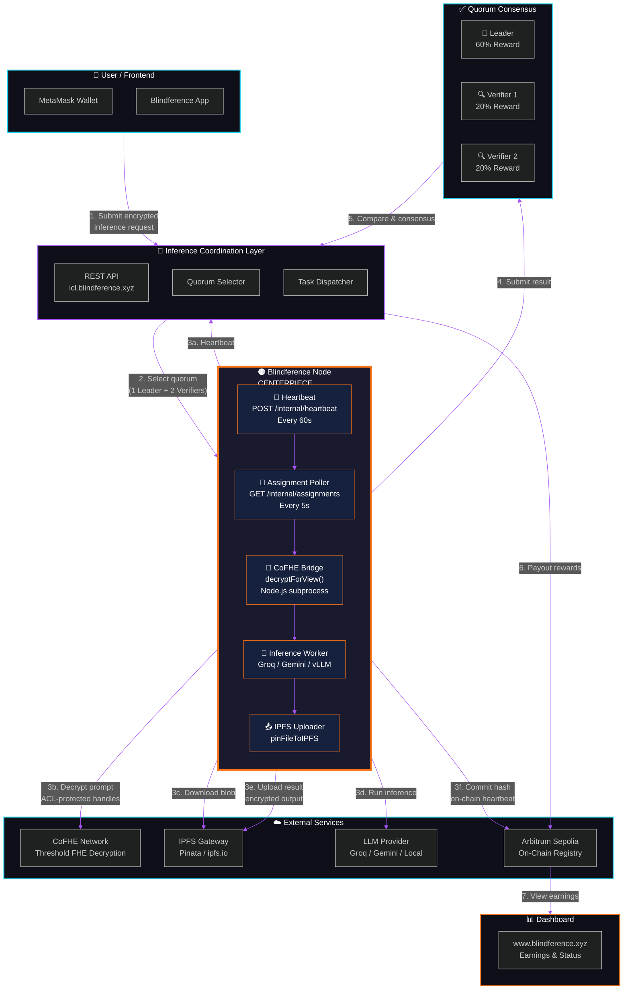

## Blindference Node Architecture

**Data Flow:**
1. **User** submits encrypted prompt via MetaMask + Blindference App
2. **ICL** (icl.blindference.xyz) selects quorum: 1 Leader + 2 Verifiers
3. **Node** receives assignment, runs 5 concurrent processes:
   - **Heartbeat** (60s): Proves liveness to ICL
   - **Poller** (5s): Checks for new inference jobs
   - **CoFHE Bridge**: Decrypts prompt via threshold FHE (ACL-protected)
   - **Inference Worker**: Runs LLM (Groq/Gemini/vLLM)
   - **IPFS Uploader**: Uploads encrypted result to IPFS
4. **Quorum**: All 3 nodes submit result hashes. Leader output used if 2+ verifiers confirm.
5. **On-Chain**: Commitments recorded, rewards auto-distributed (60% leader, 20% each verifier)
6. **Dashboard**: View real-time earnings at [www.blindference.xyz](https://www.blindference.xyz)

**API Calls Labeled:**
- `POST /internal/heartbeat` — ICL liveness proof (free, every 60s)
- `GET /internal/assignments/{addr}` — Fetch pending jobs (every 5s)
- `decryptForView()` — CoFHE threshold decryption (with sharing permit)
- `pinFileToIPFS` — Upload encrypted output to IPFS via Pinata
- `NodeRegistry.heartbeat()` — On-chain liveness (gas tx, every 10 days)

**Colors:**
- 🟠 Orange (`#f97316`) — Node processes (the hero element)
- 🔵 Cyan (`#22d3ee`) — User, external services, consensus, dashboard
- 🟣 Purple (`#a855f7`) — ICL coordination layer
- ⚫ Dark (`#0f0f1a`) — Background (matches dashboard dark theme)
